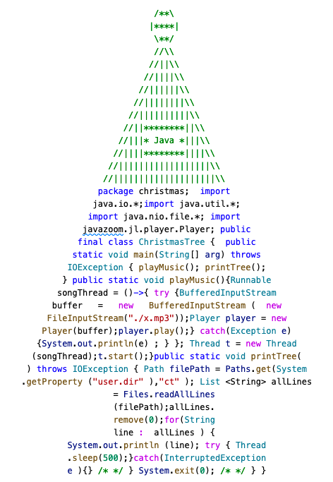

## Christmas Tree



### Introduction

This a simplified Java port of [Suren Atoyan's JavaScript Christmas Tree](https://github.com/suren-atoyan/Christmas-Tree)!
The source code is formatted in the shape of christmas tree. During execution it

 - plays Jingle Bells
 - prints it's own code line by line

### How to get it

Simply clone the repo:

```bash
git clone https://github.com/azzazzel/Java-Christmas-Tree.git
```

### How to run it on a Unix/Linux based system

Make sure you have Java 11 or newer installed and properly configured.
Make sure the `ct` file in `Java-Christmas-Tree` is executable.
Then just

```bash
cd Java-Christmas-Tree/
./ct
```

### How to run it on Windows

    ¯\_(ツ)_/¯

### How it works

The `ct` file is a Java file even though it does not have the `.java` extention. It is executed directly thanks to [JEP 330: Launch Single-File Source-Code Programs](https://openjdk.java.net/jeps/330) and the "Shebang" support it provides.


## License

MIT
